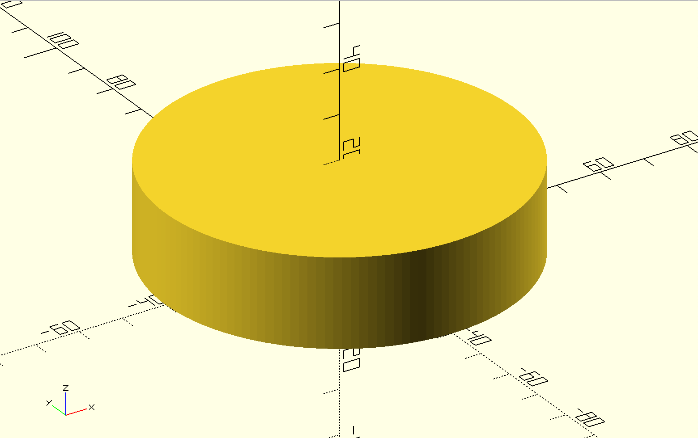

# Mooncake Making Steps

## Step 1: Create the Mooncake Body

In this step, we will create the basic shape of the mooncake, which is a cylinder.

### Code

```scad
// Mooncake parameters
mooncake_radius = 40;  // Mooncake radius
mooncake_height = 20;  // Mooncake height
resolution = 150;      // Smoothness of the circle, the larger the value, the smoother (segments)

// Create the mooncake body
module mooncake_body() {
    difference() {
        cylinder(r = mooncake_radius, h = mooncake_height, $fn = resolution);
    }
}

// Render the mooncake body
mooncake_body();
```

### Image



## Step 2: Add Patterns

In this step, I will add vertical patterns to the mooncake body, making it more real

### Code

```scad
// Mooncake parameters
mooncake_radius = 40;  // Mooncake radius
mooncake_height = 20;  // Mooncake height
resolution = 150;      // Smoothness of the circle, the larger the value, the smoother (segments)

// Pattern parameters
pattern_count = 13;    // Number of patterns
pattern_radius = 11;   // Radius of the pattern's semicircle
pattern_height = 0;    // Height of the pattern

module pattern(height) {
    translate([mooncake_radius-3, 0, height/2]) // Move to the middle of the side
    rotate([180, 0, 90]) // Adjust rotation direction to extend along the edge
    linear_extrude(height = pattern_radius * 2, center = true)
    difference() {
        circle(r = pattern_radius, $fn = resolution);
        translate([-pattern_radius, -pattern_radius * 2])
        square([pattern_radius * 2, pattern_radius * 2]);
    }
}

module mooncake_body() {
    cylinder(r = mooncake_radius, h = mooncake_height, $fn = resolution);
    
    // Add patterns, extending from bottom to top
    for (i = [0:pattern_count - 1]) {
        rotate([0, 0, i * 360 / pattern_count])
        pattern(20);
    }
}

// Render the mooncake body with patterns
mooncake_body();
```

### Explanation
In this step, we define a function called `pattern` that creates a pattern on the side of the mooncake. We then use a loop to add multiple patterns around the mooncake body.
### Image


## Step 3: Adding Top Patten

In this process, I creat a circular truncated cone at the top of cylinder. This function like a stander for subsequant patten on mooncake, including text and TaiJi patten.

```scad
// a fregment of about creating circular truncated cone
// Top bump parameter

top_height = 2;        // Total height of the top protrusion
top_layer_count = 5;   // Number of stepped layers
mooncake_radius = 40;  // Radius of the mooncake
resolution = 150;      // Smoothness of the circle, the larger the smoother (segments)

module top_pattern() {
    for (i = [0:top_layer_count-1]) {
        layer_height = top_height / top_layer_count;
        layer_radius = mooncake_radius * (1 - i * 0.008);  // Radius decreases with each layer
        
        translate([0, 0, i * layer_height])
        cylinder(r = layer_radius, h = layer_height, $fn = resolution);
    }
}
```


- The green part is created by code.

## Step 4: TaiJi patten

This is the most complicated part of this project. We need to use multiple boolean operations such as difference,intersection

The design of Tai chi patterns needs to go through the following stages:

1. Create basic structure
By this process, an annulus is created. Annuls is used to make sure lower part of TaiJi is obvious。
```scad
module taiji() {
    r = mooncake_radius * 0.4; 
    large_circle_radius = r;
    small_circle_radius = r / 2;
    
    linear_extrude(height = height) { 
        // Draw the large outer circle
        difference(){
            circle(r = large_circle_radius);
            circle(r = large_circle_radius-0.4);
        }
}

```


Seeing the patten of TaiJi, we can protrate that TaiJI symbol as: a union of a large circle and a semicircle, unioned with a small circle whose radius is half the radius of the large circle, and then differenced with the other half of the large circle. 
Thus, we can convert the task into three: 2.1: Creating the main half circle; 2.2 union or difference two small circle.

2.1 Main half circle

```scad
linear_extrude(height = height) { // converting 2D to 3D
        // Draw the large outer circle
        difference(){
            circle(r = large_circle_radius);
            circle(r = large_circle_radius-0.4);
        }
        
        difference() {
            union() {

             
                intersection() {
                    circle(r = large_circle_radius); // creating circle
                    translate([large_circle_radius, 0]) //moving position
                    square([large_circle_radius * 2, large_circle_radius * 2], center = true);
                }
            }
        }
    }
```

As code and graph demonstrate, the half circle is created by interscting a circle and a square on circles' one side.

2.2 union or difference two small circle.
Similarly we can create two little half circle, but one is Union to the main half circle another is Difference.

Thus, we can get the final image demonstration and code:

```scad
mooncake_radius = 40;
height = 2; // 添加高度参数，单位为毫米

module taiji() {
    r = mooncake_radius * 0.4; // 太极半径
    large_circle_radius = r;
    small_circle_radius = r / 2;
    
    linear_extrude(height = height) { // 添加拉伸操作
        // Draw the large outer circle
        difference(){
            circle(r = large_circle_radius);
            circle(r = large_circle_radius-0.4);
        }
        
        difference() {
            union() {
                // 左半圆
                translate([0, -small_circle_radius])
                intersection() {
                    circle(r = small_circle_radius);
                    translate([-small_circle_radius, 0])
                    square([small_circle_radius * 2, small_circle_radius * 2], center = true);
                }
                // 大圆的后半部分
                intersection() {
                    circle(r = large_circle_radius);
                    translate([large_circle_radius, 0])
                    square([large_circle_radius * 2, large_circle_radius * 2], center = true);
                }
            }
            // 右半圆的后半部分
            translate([0, small_circle_radius])
            intersection() {
                circle(r = small_circle_radius);
                translate([small_circle_radius, 0])
                square([small_circle_radius * 2, small_circle_radius * 2], center = true);
            }
        }
    }
}

taiji();
```
# Step 4: Finish Up
After adding some text on it, we can get the finally code.
```scad
// Mooncake parameters
mooncake_radius = 40;  // Mooncake radius
mooncake_height = 20;  // Mooncake height
resolution = 150;      // Smoothness of the circle, the larger the smoother (segments)

// Pattern parameters
pattern_count = 13;    // Number of patterns
pattern_radius = 11;   // Radius of the pattern semicircle
pattern_height = 0;    // Height of the pattern protrusion

// Top protrusion parameters
top_height = 2;        // Total height of the top protrusion
top_layer_count = 5;   // Number of steps

// Taiji parameters
height_taiji = 2;      // Taiji height

module pattern(height) {
    translate([mooncake_radius - 3, 0, height / 2]) // Move to the middle of the side
    rotate([180, 0, 90]) // Adjust the rotation direction to extend along the edge
    linear_extrude(height = pattern_radius * 2, center = true)
    difference() {
        circle(r = pattern_radius, $fn = resolution);
        translate([-pattern_radius, -pattern_radius * 2])
        square([pattern_radius * 2, pattern_radius * 2]);
    }
}

module top_pattern() {
    for (i = [0:top_layer_count - 1]) {
        layer_height = top_height / top_layer_count;
        layer_radius = mooncake_radius * (1 - i * 0.008);  // Decrease the radius of each layer
        
        translate([0, 0, mooncake_height + i * layer_height])
        cylinder(r = layer_radius, h = layer_height, $fn = resolution);
    }
}

module taiji() {
    r = mooncake_radius * 0.4; // Taiji radius
    large_circle_radius = r;
    small_circle_radius = r / 2;
    
    translate([0, 0, mooncake_height + top_height + 0.1])
    rotate([0, 0, 270])
    
    linear_extrude(height = height_taiji) { // Add extrusion operation
        // Draw the large outer circle
        difference() {
            circle(r = large_circle_radius);
            circle(r = large_circle_radius - 0.4);
        }
        
        difference() {
            union() {
                // Left semicircle
                translate([0, -small_circle_radius])
                intersection() {
                    circle(r = small_circle_radius);
                    translate([-small_circle_radius, 0])
                    square([small_circle_radius * 2, small_circle_radius * 2], center = true);
                }
                // Rear half of the large circle
                intersection() {
                    circle(r = large_circle_radius);
                    translate([large_circle_radius, 0])
                    square([large_circle_radius * 2, large_circle_radius * 2], center = true);
                }
            }
            // Rear half of the right semicircle
            translate([0, small_circle_radius])
            intersection() {
                circle(r = small_circle_radius);
                translate([small_circle_radius, 0])
                square([small_circle_radius * 2, small_circle_radius * 2], center = true);
            }
        }
    }
}

module text_pattern() {
    text_str = "Moon Festival";  // Change to the English name of the Mid-Autumn Festival
    char_count = len(text_str);
    font_size = mooncake_radius * 0.13; // Reduce the font size to fit the circumference
    extrude_height = 3.0; // Height of the text protrusion
    
    // Arrange the text around the top of the mooncake in a circle
    for (i = [0:char_count - 1]) {
        angle = i * 130 / char_count;
        char = text_str[i];
        
        rotate([0, 0, angle])
        translate([0, mooncake_radius * 0.7, mooncake_height]) // Place on top of the mooncake
        rotate([0, 0, 180]) // Rotate the text to be readable in top view
        linear_extrude(height = extrude_height)
        text(str(char), size = font_size, halign = "center", valign = "center");
    }
}

module mooncake_body() {
    difference() {
        cylinder(r = mooncake_radius, h = mooncake_height, $fn = resolution);
        
        // Add a small chamfer at the bottom
        //translate([0, 0, -0.1])
        //cylinder(r1 = mooncake_radius + 1, r2 = mooncake_radius - 1, h = 2, $fn = resolution);
    }
    
    // Add patterns extending from the bottom to the top
    for (i = [0:pattern_count - 1]) {
        rotate([0, 0, i * 360 / pattern_count])
        pattern(20);
    }
    
    // Add top protrusion
    top_pattern();
    
    // Add top decorative pattern
    taiji();
    
    // Add "Moon Festival" text
    text_pattern();
}

mooncake_body(); // Render the mooncake body

```

After render， we can get this image about mooncake:


Author(both for this docment and model creating)：Tony Wayne Wang
